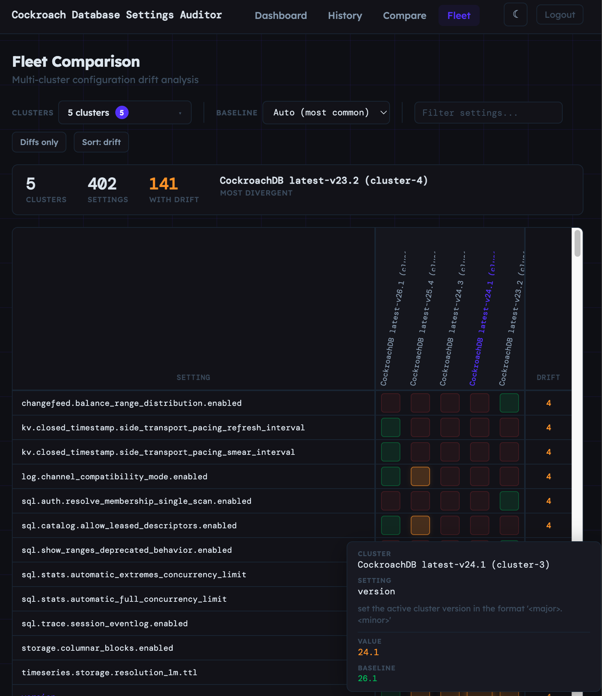

# CockroachDB Cluster Settings History

A Go service that periodically collects CockroachDB cluster settings and tracks changes over time via a web interface.



## Features

- Periodically collects `SHOW CLUSTER SETTINGS` from a CockroachDB cluster
- Stores snapshots in a separate CockroachDB database for history
- Detects and records changes (modified, added, removed settings)
- Web UI displays a table of changes with timestamps and old/new values
- Configurable polling interval (1 minute to monthly)
- Supports both secure and insecure CockroachDB clusters

## Prerequisites

- Go 1.21+
- CockroachDB cluster (the one being monitored)
- Access to create a database and user for storing history

## Build

```bash
go build -o cluster-history .
```

## Quick Start

### 1. Initialize the history database

This creates a dedicated database and user for storing settings history:

```bash
# Connect with admin privileges
export DATABASE_URL="postgresql://root@localhost:26257/defaultdb?sslmode=disable"

# For secure clusters, set a password
export HISTORY_PASSWORD="your_secure_password"

# Run initialization
./cluster-history init
```

The init command will:
- Create the `cluster_history` database
- Create the `history_user` user
- Grant necessary privileges
- Detect insecure mode automatically (skips password in insecure mode)

### 2. Run the service

```bash
# Connection to the cluster being monitored
export DATABASE_URL="postgresql://root@localhost:26257/defaultdb?sslmode=disable"

# Connection to the history database
export HISTORY_DATABASE_URL="postgresql://history_user@localhost:26257/cluster_history?sslmode=disable"

# Start the service
./cluster-history
```

Open http://localhost:8080 to view the changes dashboard.

## Configuration

### Environment Variables

| Variable | Command | Description | Default |
|----------|---------|-------------|---------|
| `DATABASE_URL` | both | CockroachDB connection string. For `init`: admin connection. For server: monitored cluster | required |
| `HISTORY_DATABASE_URL` | server | Connection to history database | required |
| `POLL_INTERVAL` | server | How often to collect settings (Go duration) | `15m` |
| `HTTP_PORT` | server | Web server port | `8080` |
| `HISTORY_DB_NAME` | init | Database name to create | `cluster_history` |
| `HISTORY_USERNAME` | init | Username to create | `history_user` |
| `HISTORY_PASSWORD` | init | Password for user (optional in insecure mode) | - |

### Poll Interval Examples

```bash
export POLL_INTERVAL="1m"    # Every minute
export POLL_INTERVAL="15m"   # Every 15 minutes (default)
export POLL_INTERVAL="1h"    # Every hour
export POLL_INTERVAL="24h"   # Daily
export POLL_INTERVAL="720h"  # Monthly (30 days)
```

## Architecture

```
┌─────────────────┐     ┌──────────────┐     ┌─────────────────┐
│  CockroachDB    │────▶│  Collector   │────▶│  CockroachDB    │
│  (monitored)    │     │  (periodic)  │     │  (history db)   │
└─────────────────┘     └──────────────┘     └─────────────────┘
                                                     │
                                                     ▼
                                             ┌─────────────┐
                                             │  Web Server │
                                             │  (diff UI)  │
                                             └─────────────┘
```

### Components

- **Collector**: Periodically queries `SHOW CLUSTER SETTINGS` and stores snapshots
- **Storage**: Manages history database, detects changes between snapshots
- **Web Server**: Displays changes in a table with timestamps

### Database Schema

```sql
-- Snapshots of settings at a point in time
CREATE TABLE snapshots (
    id SERIAL PRIMARY KEY,
    collected_at TIMESTAMPTZ NOT NULL
);

-- Individual settings within each snapshot
CREATE TABLE settings (
    id SERIAL PRIMARY KEY,
    snapshot_id INT REFERENCES snapshots(id),
    variable TEXT NOT NULL,
    value TEXT NOT NULL,
    setting_type TEXT,
    description TEXT
);

-- Detected changes between snapshots
CREATE TABLE changes (
    id SERIAL PRIMARY KEY,
    detected_at TIMESTAMPTZ NOT NULL,
    variable TEXT NOT NULL,
    old_value TEXT,
    new_value TEXT
);
```

## Development

### Run Tests

```bash
# Set up test database
export DATABASE_URL="postgresql://root@localhost:26257/defaultdb?sslmode=disable"
export HISTORY_DATABASE_URL="postgresql://history_test_user@localhost:26257/cluster_history_test?sslmode=disable"

# Run all tests
go test -v ./...

# Run with coverage
go test -coverprofile=coverage.out ./...
go tool cover -func=coverage.out
```

### Project Structure

```
cluster-history/
├── main.go              # Entry point, CLI handling
├── cmd/
│   └── init.go          # Database/user initialization
├── collector/
│   └── collector.go     # Periodic settings collection
├── storage/
│   └── store.go         # CockroachDB storage operations
├── web/
│   ├── server.go        # HTTP server
│   └── templates/
│       └── index.html   # Web UI template
└── *_test.go            # Tests
```

## License

MIT
